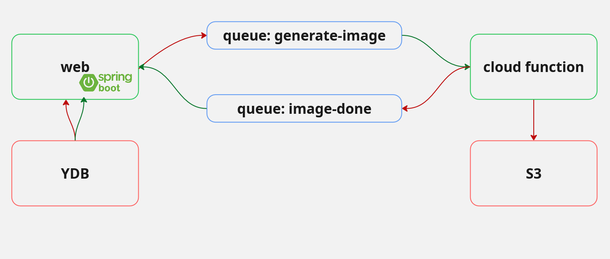

# Требования проекта

1. Реализовывать полный набор CRUD-операций над какими либо данными (Create, Read, Update, Delete).
2. Будет построен на базе любого фреймворка и языка программирования (Пример: PHP -> YII, Laravel, Python -> Django,
   Flask, Java -> SpringBoot, JS -> Angular, React и т.д.). Данный критерий будет засчитан при наличии самостоятельно
   написанного кода. То есть, если. Вы просто развернёте условный WordPress, – по данному критерию получите 0 баллов.
3. База данных (MySQL, PostgreSQL, MongoDB и т. д.) должна использоваться в виде кластера контейнера docker с корректным
   обеспечением персистентности данных (на отдельном диске). Либо использовать только Serverless YDB
4. Для размещения статических файлов приложение в своей работе должно использоваться Object Storage.
5. В решении должен быть использован балансировщик нагрузки Yandex.Cloud.
6. Разворачивание всей информационной системы должно быть описано общей Terraform-спецификацией.
7. В решении должна быть затронута настройка Виртуальных сетей Yandex Cloud.
8. Также в информационной системе должны быть использованы какие-либо Serverless-решения (Cloud Functions, Serverless
   Containers, Yandex Message Queue).

Каждый критерий даёт 12,5 баллов. Но есть одно исключение: если проект работает без ВМ, только на serverless, то
критерии 1,2,5,6 будут зачтены автоматически.

Дополнительно:

1. Должен быть настроен мониторинг системы с использованием Cloud Logging, Yandex Monitoring и т.п.
2. Должна быть описана ролевая модель доступа к ресурсам и настроен сервис Identity and Access Management.
3. Расчёт стоимости эксплуатации системы при минимальной, средней и максимальной нагрузке. Рекомендации по экономии
   ресурсов.

## Выполнение требований

1. Сделаем приложение по генерации изображений. Изображение можно сгенерировать (POST), изменить описание (PUT),
   удалить (DELETE), посмотреть (GET). Генерировать изображения будет нейросеть (у Cloudflare есть api)
2. Будем использовать в качестве "сердца" Spring Boot. Сам процесс генерации изображений сделаем асинхронным, это будет
   функция serverless, может быть подумаем о python
3. В текущем варианте лучше выбрать Serverless YDB. [SDK для Java](https://github.com/ydb-platform/ydb-java-sdk),
   примеры [использования](https://github.com/ydb-platform/ydb-java-examples/tree/master)
4. Все изображения готовые заливаем в s3. [SDK](https://yandex.cloud/ru/docs/storage/tools/sdk/)
5. Скорее всего не будет, так как у нас не будет VM
6. Будет сделано 🫡
7. Создадим сеть и подсети в каждой зоне доступности
8. Cloud Functions и Yandex Message Queue (для java
   пойдёт [aws sdk](https://yandex.cloud/ru/docs/message-queue/instruments/))

Можно из дополнительно взять Identity and Access Management + мониторинг (правда в Яндекс мониторинг не хочется, только
если grafana и prometheus прикрутить, хотя это не считается вероятно)

# Запуск в облаке

## Настройте yc cli

Здесь подробно как это сделать - https://yandex.cloud/ru/docs/cli/quickstart

## Создание S3

Хранилище живет отдельно, потому что потом в дальнейшем при удалении необходимо сначала очистить бакет от всех
сохраненных объектов. Из-за этого `terraform destroy` ломается.

1. Перейти на страницу **Object Storage**
2. Имя - **yandex-cloud-2025-images**
3. Максимальный размер - **1 гигабайт**
4. Класс хранилища - **стандартное**
5. Чтение объектов - **для всех**, остальное - с авторизацией
6. Создаем бакет

## Создание сетей

Сети создаем заранее, т.к. у облака есть с этим проблемы. (См. проблемы с облаком)

1. Зайти в консоль в *VPC*. Пункт - **облачные сети**
2. Создайте сеть с названием **common**
3. Перейдите во вкладку **подсети**
4. Создайте три подсети, в каждой зоне доступности:
    - ru-central1-a: 10.1.0.0/16 - common-a
    - ru-central1-b: 10.2.0.0/16 - common-b
    - ru-central1-d: 10.3.0.0/16 - common-d

## Подготовка docker образа

1. Перейдите в облаке в **Container Registry**
2. Создайте реестр
3. Настройте авторизацию в docker registry: `yc container registry configure-docker`
4. Скачайте готовый образ из github: `docker pull ghcr.io/yakovlev05/yandex-cloud-2025:main`
5. Измените tag:
   `docker tag ghcr.io/yakovlev05/yandex-cloud-2025:main cr.yandex/<твой_registry_id>/yandex-cloud-2025:main`
6. Загрузите образ в Яндекс: `docker push cr.yandex/<твой_registry_id>/yandex-cloud-2025:main`
7. Проверьте, что образ загружен

## Установка и [настройка](https://yandex.cloud/ru/docs/tutorials/infrastructure-management/terraform-quickstart) terraform

1. Перейти на сайт [terraform](https://developer.hashicorp.com/terraform/install) и скачать под нужную ОС.
2. Создайте сервисный аккаунт в облаке Яндекс
    - перейдите в **Identity and Access Management**
    - создайте сервисный аккаунт с названием **terraform**
    - назначьте роль **admin**
    - создайте IAM токен (живет не более 12 часов) и положите в переменную окружения. Это можно сделать через
      `export YC_TOKEN=$(yc iam create-token --impersonate-service-account-id <идентификатор_сервисного_аккаунта>)`
3. Настройка переменных окружения. Ранее уже настроили **YC_TOKEN**, теперь настроим остальные:
    - укажите в переменной окружения **идентификатор облака**. `export TF_VAR_cloud_id=$(yc config get cloud-id)`
    - укажите в переменной окружения **идентификатор каталога**. `export TF_VAR_folder_id=$(yc config get folder-id)`
    - настройте Cloudflare. Для генерации используется Workers AI от CF. Нам нужен id аккаунта и токен с доступом к
      Workers Ai. Получите их и настройте: `export TF_VAR_cf_account_id=<токен>` и `export TF_VAR_cf_auth_token=<токен>`

4. Откройте файл `nano ~/.terraformrc` (Windows - %APPDATA%). Вставьте в него:

```
provider_installation {
  network_mirror {
    url = "https://terraform-mirror.yandexcloud.net/"
    include = ["registry.terraform.io/*/*"]
  }
  direct {
    exclude = ["registry.terraform.io/*/*"]
  }
}
```

5. Конфигурация terraform. Скачайте **main.tf** - это готовая конфигурация.
6. В директории с `main.tf` выполните `terraform init`
7. Можно запускать. Введите `terraform apply`. Шпаргалка:
    - `terraform validate` - провалидировать конфигурацию
    - `terraform fmt` - форматирование конфигурации
    - `terraform plan` - вывод всех ресурсов, которые будут созданы. Просто для проверки
8. По завершении удалите всё - `terraform destroy`

Документации по ресурсам, используемых в terraform (одно и то же, но в разных местах):

- https://registry.terraform.io/providers/yandex-cloud/yandex/latest/docs
- https://yandex.cloud/ru/docs/terraform

# Проблемы с Яндекс облаком

## Не удаляется сеть

Может возникнуть проблема, что сеть не удаляется. В ответе пишется, что сеть используется, но в консоли ничего нет. Вся
проблема в **serverless network**. Они создаются сами при использовании serverless ресурсов, например, функций. Сами они
не удаляются, точнее удаляются асинхронно, то есть не сразу.

Посмотреть список:

```
yc serverless network list
```

Запланировать удаление - в ответ вернётся дата удаления

```
yc serverless network trigger-used-cleanup --id <id>
```

# О Проекте

Здесь рассказывается информация о проекте, как техническая, так и более верхнеуровневая.

## Ценность

Небольшой "сервис", который представляет собой бэк на Spring Boot, а фронтенд на шаблонизаторе JTE. Пользователь может
зайти на сайт, ввести промпт и получить сгенерированную картинку. Картинки генерирует нейросеть, в качестве апи выбран
Cloudflare.

Для проекта нужно было использовать возможности облака, поэтому в качестве бд выбрана YDB, используется очереди
сообщений от Яндекса и сами картинки генерируются в серверлесс функции.

## Ролевая модель

Здесь описана ролевая модель сервисных аккаунтов. Основная идея - дать как более узкий доступ на ресурсы.

### terraform

Аккаунт, под которым работает terraform

**Роли:** `admin`

### docker-group

Аккаунт, который используются облаком для управления группой виртуальных машин (удаление, создание, обновление)

**Роли:** `editor`

### docker

Аккаунт, который назначается на каждую виртуальную машину. От имени этого аккаунта бэк на Spring Boot ходит в другие
сервисы. Бэк ходит в базу данных YDB, пишет сообщения в очередь, читает очередь.

**Роли:** `ydb.editor`, `ymq.reader`, `ymq.writer`

### func

Аккаунт, под которым работает функция. Загружает картинки в s3, пишет и читает очередь.

**Роли:** `storage.uploader`, `ymq.reader`, `ymq.writer`

### trigger

Аккаунт для работы триггера. Триггер управляет очередью и вызывает функцию.

**Роли:** `functions.functionInvoker`, `ymq.admin`

# Архитектура

